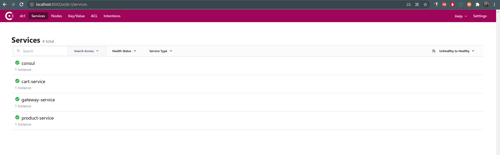

#1. Software Development Principles, Software Architect:

### 1.1 Microservices
 Capabilities, Physical Diagram, Deployment Diagram please refer this link: https://docs.google.com/presentation/d/1Fu90G93mC-CYMR60GxRJxyCycQsA-Sju7QNCfDmr9dI/edit?ouid=112441078857592710160&usp=slides_home&ths=true
### 1.2 Custom Unitest framework:
 Vẽ cái diagram của entity ra.
#2. Code Structure, libs, framework
###2.1 This project using Gradle with multiple sub-modules inside.

###2.2: Libs
| Name      | Description |
| ----------- | ----------- |
| consul   | Services discovery, Centralize configuration        |
| Spring boot, Spring Cloud      | Spring framework to create a java web application and microservies app       |
| lombok   | shorter on getter/setter/builder of a class        |
| flyway   | SQL versioning management        |
| actuator   | spring app command interface through RESTful API.        |
#3. How to make it run
###3.1 Prerequisite
| Env      | Description |
| ----------- | ----------- |
| JDK      | version 11       |
| Ubuntu   | version 16.04 or 20.04        |
| docker   | version 20.10 or higher        |
| docker-compose   | version 1.29.2 or higher        |
###3.2 Make docker images
 _in case your directory set a `chmod < 777` => need public the file `build.sh` to public by `sudo chmod +x ./build.sh` _
```
./build.sh
```
### 3.3 Start containers
```docker-compose up -d```
### 3.4 Test with custom test framework
```./gradlew :business:product-service:test```

After docker run, you can see the containers will be run by `docker ps` and can view all  instances of all services through consul host:
http://localhost:8502/ui/dc1/services

#4. API spec.
 -- product-service & cart-service applied swagger so we can access though a web-browser to interact with an API.
<table>
 <tr>
   <td> Service </td>  <td> Request </td> <td> Response </td>
 </tr>
 <tr>
  <td> product-service find all	 </td>
  <td> http://{YOURIP}:37080/product-service/product/find?branch=branch&category=category&color=color&name=name&page=0&size=100
	 </td>
  <td>
  
  ```json
  {
   "details": [
    {
     "category": "string",
     "description": "string",
     "name": "string",
     "price": 0,
     "productId": 0
    }
   ],
   "page": 0,
   "size": 0,
   "total": 0
  }
  ```

  </td>
</tr>

<tr>
  <td> product-service-find detail	 </td>
  <td> curl -X GET "http://{YOURIP}}:37080/product-service/product/find/1" -H "accept: */*"	 </td>
  <td>

  ```json
  {
 "productId": 1,
 "name": "Hoddies",
 "description": "Description - 8",
 "price": 200,
 "category": "Clothing"
}
  ```

  </td>
</tr>
<tr>
<td> cart-service add to cart</td>
<td>
curl -X POST "http://{YOUR_IP}:38082/cart" -H "accept: */*" -H "Content-Type: application/json" -d "{ \"productIds\": [ 1 ]}"
  ```json
  {
 "productId": 1,
 "name": "Hoddies",
 "description": "Description - 8",
 "price": 200,
 "category": "Clothing"
}
  ```

</td>
</tr>
</table>